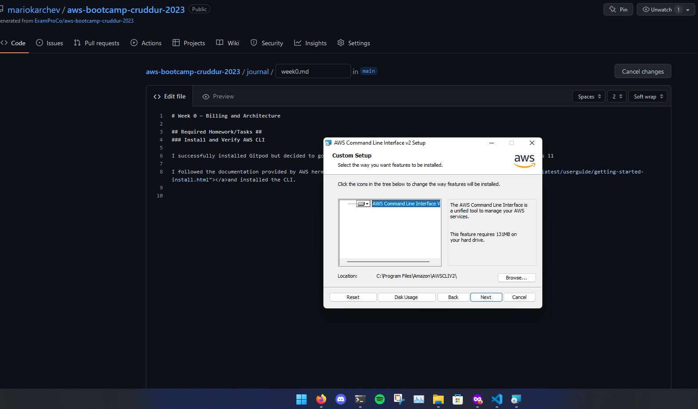
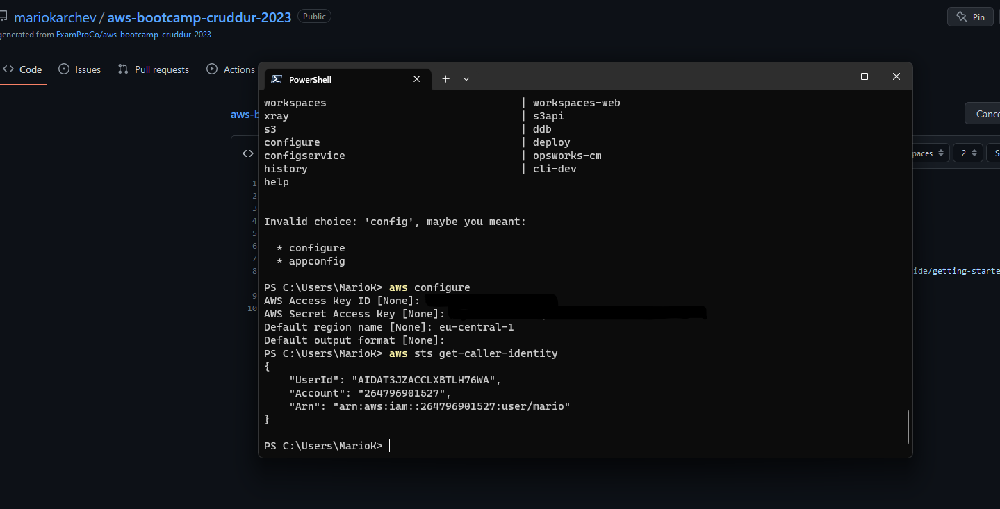
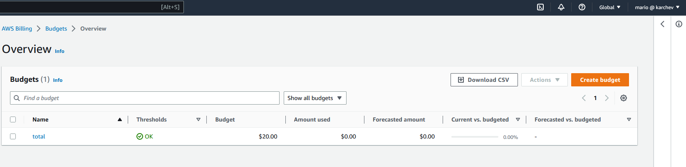
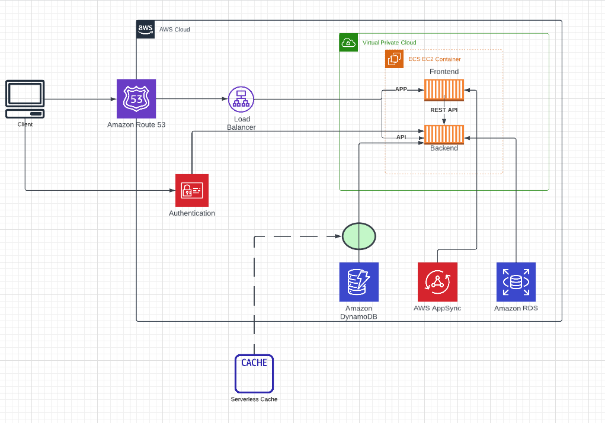

# Week 0 — Billing and Architecture

## Required Homework/Tasks ##
### Install and Verify AWS CLI

I successfully installed Gitpod but decided to go with local alternative - Visual Studio Code and Git on my PC - Windows 11

I followed the documentation provided by AWS link --> [AWS CLI Installation on WIndows](https://docs.aws.amazon.com/cli/latest/userguide/getting-started-install.html)

Downloaded the installer - msi and executed it.

After the installation I configured it using my IAM user's credentials in order to be able to establish connection with AWS.

### Create a Billing Alarm

I created a bidget with $20 limit. This is the maximum amount that I can afford to spend if something goes wrong 🤞
Hope this one is enough.

### Conceptual Diagram in Lucid Charts

Here you can find the conceptiual diagram I created in Lucid Chart

### Recreate Logical Architecture design

I have recreated the logical diagram.

You can find the in here --> [Lucid Chart Share Link](https://lucid.app/lucidchart/9b3bd4b1-c3fc-46b6-8471-213e6844d7fe/edit?viewport_loc=-507%2C-45%2C3012%2C1464%2C0_0&invitationId=inv_7cfbfc11-ffd5-48f3-aa92-c51a264dc4b8)
